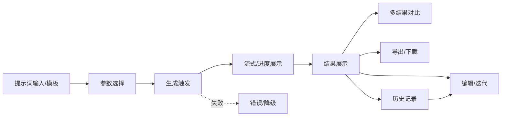

# 02 · 产品能力与交互优化（z-biz-tool-aigen）

> 状态：设计方案，未实现
> 基线 HEAD：`713808c`
> 当前事实 = 静态代码证据；指标 = 拟定验收目标（假设见括注）。

本文件按 AI 生成完整流程逐环节梳理"现状 → 缺口 → 优化 → 优先级"。可对标 ChatGPT（对话式迭代/流式）、Midjourney（多结果网格/放大重绘）、ComfyUI（参数化工作流）的**交互理念**，但不复制其商业实现、不引用其实时数据。

## 流程全景

## 1. 提示词输入与模板

- **现状**：文本面板有客户端硬编码模板 `promptTemplates`（[`TextGenPanel.tsx`](../../src/components/TextGenPanel.tsx) 第 17-23 行），拼接方式为 `模板 + 用户输入`（第 38 行）；图片/视频/PPT 面板只有裸输入框，无模板、无 system prompt。
- **缺口**：模板不可编辑/不可保存/不可分享；无变量占位（如 `{主题}{字数}{语气}`）；无提示词历史复用；无负面提示词（图片场景常见）。
- **优化（P1）**：
  1. 引入"提示词模板库"数据模型（见 03 §数据模型），支持内置 + 用户自定义 + 变量插槽。
  2. 图片面板增加"风格预设/负面提示词/参考图"字段（依赖 03 的参数透传修复 B1）。
  3. 提示词输入框支持从历史记录一键回填（依赖历史持久化 C1）。
- **验收目标**：用户可保存 ≥20 条自定义模板并跨重启保留（假设：本地存储可用）。

## 2. 生成触发与流式展示

- **现状**：点击按钮 → `useGeneration.generate` → `invoke` 一次性等待（[`useGeneration.ts`](../../src/_shared/useGeneration.ts) 第 17-28 行），期间仅 `<Spin tip="AI创作中...">`（[`TextGenPanel.tsx`](../../src/components/TextGenPanel.tsx) 第 54 行）。文本走非流式 `chat/completions`（[`ai_client.rs`](../../src-tauri/src/ai_client.rs) 第 141-179 行）。
- **缺口**：无逐字流式、无进度百分比、无"取消"按钮、无耗时/ token 统计；长文本体验为"黑盒等待"。
- **优化（P0/P1）**：
  1. **P0** 先补"取消 + 超时"（对应 03 §LLM 调用架构、01 C2/C3）。
  2. **P1** 文本生成改流式：Rust 侧 SSE 增量 → Tauri event 推前端逐段渲染（03 §流式）。
  3. **P1** 图片/视频显示阶段化进度（提交/排队/生成中/完成）。
- **验收目标**：文本首字节展示 ≤ 2s（假设：上游支持 stream 且网络正常）；任意生成可在 1 次点击内取消。

## 3. 结果编辑与迭代

- **现状**：文本结果只读展示（[`TextGenPanel.tsx`](../../src/components/TextGenPanel.tsx) 第 60 行 `Paragraph`）+ 复制；图片结果只有下载/复制 URL（[`ImageGenPanel.tsx`](../../src/components/ImageGenPanel.tsx) 第 80-83 行）。无"在此基础上继续改"。
- **缺口**：不能对结果二次编辑、不能"再生成一版"、不能把结果作为下一轮上下文/参考。
- **优化（P1）**：
  1. 文本结果转为可编辑区，提供"重写/扩写/精简/换语气"快捷指令（复用模板库）。
  2. 图片提供"重绘/微调（variation）"入口（依赖上游能力，H4 待验证）。
  3. 迭代链保存到历史，形成"提示词→结果→再提示词"血缘。
- **验收目标**：从任一历史结果可 1 步发起迭代生成（假设：迭代命令契约见 03）。

## 4. 多结果对比

- **现状**：图片支持 `count` 1-10（[`ImageGenPanel.tsx`](../../src/components/ImageGenPanel.tsx) 第 116 行）并网格展示（第 68-86 行），这是唯一的多结果能力；文本/视频单次单结果。
- **缺口**：无"同提示词多模型并排对比"、无结果打分/择优、无差异高亮。
- **优化（P2）**：
  1. 文本支持一次请求多模型（依赖 03 多 Provider 适配），并排展示供择优。
  2. 图片网格增加"选为主图/放大"交互（对标 Midjourney 理念）。
- **验收目标**：≥2 个模型的同题结果可同屏对比（假设：用户配置了多 Provider）。

## 5. 历史记录

- **现状**：后端在生成成功后 `insert` 到内存 `Vec` 并 `truncate(100)`（[`commands.rs`](../../src-tauri/src/commands.rs) 第 28-34 行）；`get_history` 返回（第 76-79 行）；store 有 `loadHistory`（[`aiStore.ts`](../../src/stores/aiStore.ts) 第 87-94 行）但**无任何 UI 渲染 history**，且面板生成绕过 store（C5）。
- **缺口**：历史不可见、不持久（重启即失 C1）、无搜索/筛选/收藏/删除、时间戳不可读（B5）、图片多结果拼接不可靠（B6）。
- **优化（P1）**：
  1. 新增"历史记录"侧栏/抽屉，按 kind 筛选、关键词搜索、分页。
  2. 历史落盘（03 §持久化：SQLite 或 JSONL 原子写），字段含可读时间、模型、参数、结果引用（本地文件路径而非 base64 内联）。
  3. 支持删除单条 / 清空（删除属破坏性操作，须二次确认，见 04）。
- **验收目标**：重启后历史 100% 保留；单条历史可回填提示词并迭代。

## 6. 导出

- **现状**：图片 `<a download href={url}>`（[`ImageGenPanel.tsx`](../../src/components/ImageGenPanel.tsx) 第 49-55 行，H2 待验证）；文本复制剪贴板（[`TextGenPanel.tsx`](../../src/components/TextGenPanel.tsx) 第 46-51 行，H1）；PPT `href` 指向临时 HTML（B3）；视频无导出。
- **缺口**：无"导出到用户指定目录"、无批量导出、无格式选择（图片 png/webp、文本 md/txt、PPT 真实 pptx）。
- **优化（P1/P2）**：
  1. 统一走 Tauri `dialog` 保存对话框 + `fs` 写入（已引入插件，见 [`lib.rs`](../../src-tauri/src/lib.rs) 第 11-12 行），落盘到用户选定路径而非 temp（B3）。
  2. 图片/文本导出支持格式选择；PPT 目标产出真实 `.pptx` 或稳定的可打开 HTML（阶段四）。
- **验收目标**：三类结果均可导出到用户目录并二次打开成功（假设：用户授予保存路径）。

## 7. 批量生成

- **现状**：仅图片有 `count` 批量（同一次请求 n 张）；无"多提示词批量任务队列"。
- **缺口**：不能一次提交一组提示词、无任务队列/进度总览、无并发上限控制。
- **优化（P2）**：引入批量任务队列（03 §并发），支持导入提示词清单、逐条执行、失败重试、整体进度。
- **验收目标**：≥10 条提示词的批量任务可后台顺序/受控并发执行且不阻塞 UI（假设：并发上限默认 2）。

## 8. Agent 辅助

- **现状**：`src/agent/` 是与本项目无关的 **SQL Agent 死代码**，且全为 mock（[`AgentManager.ts`](../../src/agent/AgentManager.ts) 第 40-46 行等，A1）。**当前不存在任何面向 AI 生成的 Agent 能力。**
- **缺口**：无"提示词优化助手"、无"根据目标自动选择模型/参数"、无多步生成编排。
- **优化（P2，重新设计）**：
  1. 清理 SQL Agent 残留（05 任务 T-A1）。
  2. 新建面向生成的助手：提示词改写建议、参数推荐、失败诊断——**仅产出建议，任何落盘/覆盖/删除须用户显式确认**（核心原则：Agent 不自动执行破坏操作，见 04 §6）。
- **验收目标**：助手建议采纳前不产生任何文件写入或 API 调用副作用。

## 9. 交互一致性缺口（横向）

| 缺口 | 现状证据 | 优先级 |
| --- | --- | --- |
| 面板切换丢结果（C6） | [`App.tsx`](../../src/App.tsx) 第 91-94 行条件渲染卸载 | P1 |
| 复制通道不统一（H1） | 用 `navigator.clipboard` 而非已引入的 clipboard-manager | P2 |
| 无全局生成中提示 | 各面板独立 loading，切走即失联 | P1 |
| 配置弹窗无连通性校验 | [`App.tsx`](../../src/App.tsx) 第 46-54 行保存即成功，不验证 key/url | P1 |

## 10. 能力优先级总表

| 能力 | 优先级 | 依赖 |
| --- | --- | --- |
| 生成取消/超时反馈 | P0 | 03 调用架构 |
| 图片 model/size 真正生效（B1） | P0 | 03 参数透传 |
| 失败降级与友好错误 | P0 | 03 错误分级 |
| 历史可见 + 持久化 | P1 | 03 持久化 |
| 文本流式展示 | P1 | 03 流式 |
| 结果编辑/迭代 | P1 | 历史持久化 |
| 导出到用户目录（含 PPT 稳定产物） | P1 | fs/dialog |
| 多模型对比 | P2 | 03 多 Provider |
| 批量任务队列 | P2 | 03 并发 |
| 生成助手 Agent（非破坏） | P2 | 04 边界 |
