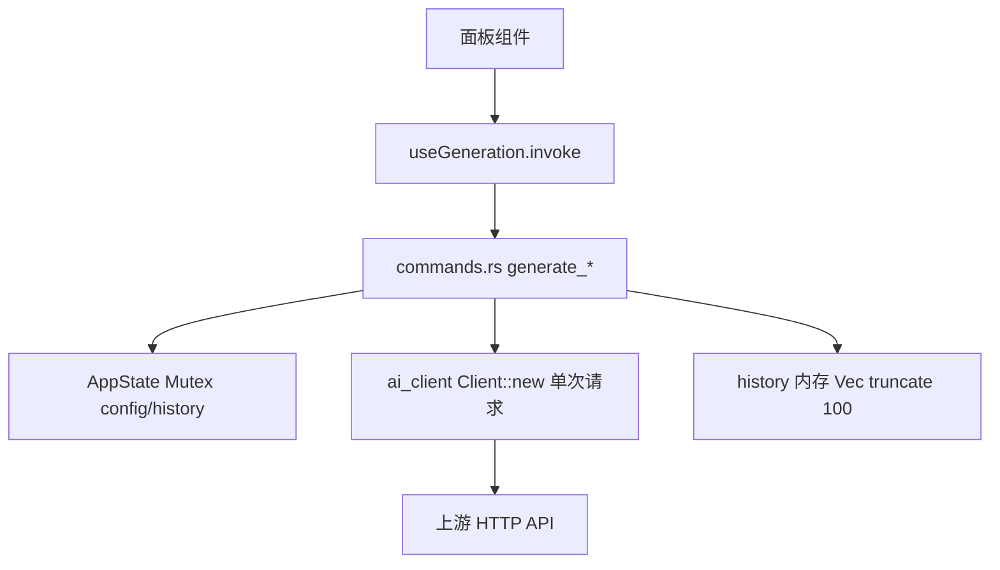
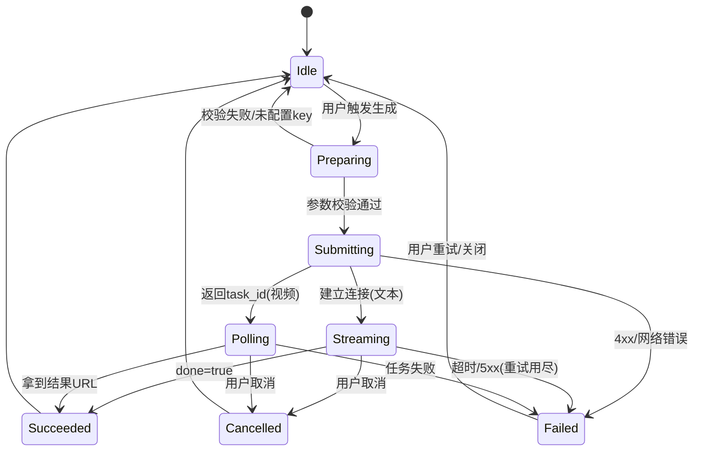

# 03 · 技术架构与性能优化（z-biz-tool-aigen）

> 状态：设计方案，未实现
> 基线 HEAD：`713808c`
> 当前事实 = 静态代码证据；指标 = 拟定验收目标（假设见括注）。

## 1. 现状调用链（事实）



问题定位：`Client::new()` 每请求新建（[`ai_client.rs`](../../src-tauri/src/ai_client.rs) 第 85/139/189 行）、无 timeout/retry/stream/cancel；历史仅在内存（[`commands.rs`](../../src-tauri/src/commands.rs) 第 28-34 行）；面板绕过 store 直接 invoke（C5）；配置全局单 base_url（B4）。

## 2. 推荐 LLM 调用架构

### 2.1 共享 HTTP Client + 超时
- 用 `reqwest::Client::builder()` 构建**全局单例**（连接池复用），设置：
  - `connect_timeout`（目标 10s）、`timeout`（文本 120s / 图片 180s / 视频提交 30s）、`pool_idle_timeout`。
- 验收目标：断网时请求在 ≤ connect_timeout+1s 内失败返回（假设：DNS/TCP 层可判定失败）。

### 2.2 流式（文本）
- Rust 侧对 `chat/completions` 传 `"stream": true`，用 `resp.bytes_stream()` 解析 SSE（`data: {...}` / `[DONE]`）。
- 通过 Tauri `AppHandle.emit("aigen://stream/{request_id}", chunk)` 推送增量；前端订阅累加渲染。
- IPC 契约（建议）：
  - 命令 `generate_text_stream(params) -> { request_id }`（立即返回）。
  - 事件 `aigen://stream/{request_id}`：`{ delta: string, done: bool, usage?: {prompt_tokens,completion_tokens} }`。
  - 事件 `aigen://error/{request_id}`：`{ code, message, retryable }`。

### 2.3 取消
- 每个请求分配 `request_id`，Rust 侧保存 `CancellationToken`（或 `AbortHandle`）于 `AppState`；命令 `cancel_generation(request_id)` 触发 drop，reqwest future 被中止，连接释放。
- 前端 `useGeneration` 暴露 `cancel()`，按钮态在 loading 时切换为"取消"（补足 01 C3）。

### 2.4 重试与退避
- 仅对**幂等且可重试**错误（网络超时、5xx、429）指数退避重试（建议最多 2 次，base 800ms，抖动）。
- 4xx（401/400/403）**不重试**，直接映射为可读错误（见 §7）。
- 验收目标：模拟 429 一次后第二次成功的场景，用户无感（假设：mock 上游可编程返回）。

## 3. 多模型 / 多 Provider 适配

- 现状：单 `base_url`（默认 minimax，[`ai_client.rs`](../../src-tauri/src/ai_client.rs) 第 17 行）却混列 OpenAI/MiniMax 模型（B4）。
- 推荐：引入 `Provider` 抽象，配置从"单 base_url+key"升级为"Provider 列表"：

```jsonc
// ~/.z-biz-tool-aigen/providers.json（规划新增，非现有）
{
  "providers": [
    { "id": "openai", "name": "OpenAI", "base_url": "https://api.openai.com/v1",
      "capabilities": ["text","image"], "models": ["gpt-4o","dall-e-3"] },
    { "id": "minimax", "name": "MiniMax", "base_url": "https://api.minimax.chat/v1",
      "capabilities": ["text","video"], "models": ["abab6.5s-chat"] }
  ],
  "active": { "text": "openai", "image": "openai", "video": "minimax" }
}
```

- 每个 Provider 关联各自的 key（key 存储见 04，不明文、不回传前端）。
- 生成请求携带 `provider_id + model`，后端据此路由，杜绝"OpenAI 模型打 MiniMax 端点"。

## 4. 提示词与上下文管理

- 提示词分层：`system prompt`（角色/约束）+ `template`（含变量插槽）+ `user input`。现状文本仅 `user` 单条消息（[`ai_client.rs`](../../src-tauri/src/ai_client.rs) 第 143-145 行）、`temperature` 硬编码 0.7（第 146 行）。
- 建议参数化：`temperature/top_p/max_tokens` 由前端或模板提供，后端不写死。
- 上下文管理：迭代生成时按 token 预算裁剪历史消息（保留最近 N 轮 + 摘要），避免无限增长。

## 5. 生成状态机（统一）



- 状态集中在 store（替代当前面板各自 `useGeneration` 的分散态，修 C5/C6），面板订阅。
- 建议 IPC/前端状态字段：`{ requestId, kind, status, progress?, partial?, resultRef?, error? }`。

## 6. 结果持久化与增量

- **历史持久化**（修 C1）：从内存 `Vec` 改为落盘。二选一：
  - 轻量：JSONL 追加 + 定期压实（原子写见 04 §5）。
  - 稳健：SQLite（`rusqlite`），支持搜索/分页/去重。
- **结果引用而非内联**（修 B6）：图片/视频/PPT 结果保存为本地文件（`~/.z-biz-tool-aigen/results/{id}.png` 等），历史只存**路径引用 + 元数据**，杜绝 base64 内联导致的历史膨胀。
- 建议数据模型：

```jsonc
// HistoryRecord（规划新增）
{
  "id": "uuid",
  "kind": "image|text|video|ppt",
  "provider_id": "openai",
  "model": "dall-e-3",
  "prompt": "...",
  "params": { "size": "1024x1024", "count": 2, "temperature": 0.7 },
  "result_refs": ["results/xxx-1.png"],   // 文件引用
  "text_result": "…",                       // 文本类可直接存
  "status": "succeeded",
  "created_at": "2026-09-21T10:00:00Z",     // ISO8601（修 B5）
  "usage": { "prompt_tokens": 0, "completion_tokens": 0 },
  "favorite": false
}
```

- **增量写入**：流式文本过程中不落盘，`Succeeded` 后一次性写入完整记录，避免半成品污染历史。

## 7. 错误分级与降级

统一错误契约（替代当前 `String(e)` 裸传，[`useGeneration.ts`](../../src/_shared/useGeneration.ts) 第 23-24 行）：

| code | 含义 | 可重试 | 用户提示 & 降级 |
| --- | --- | --- | --- |
| `NO_CONFIG` | 未配置 base_url/key | 否 | 引导打开配置弹窗 |
| `AUTH` | 401/403 密钥无效 | 否 | 提示检查密钥，不回显密钥 |
| `RATE_LIMIT` | 429 | 是 | 退避重试，提示稍后再试 |
| `UPSTREAM_5XX` | 上游服务错 | 是 | 重试；持续失败提示换 Provider |
| `TIMEOUT` | 超时 | 是 | 提示网络/缩短提示词 |
| `PARSE` | 响应结构异常 | 否 | 降级展示原始文本片段（参照 PPT 降级范式 E3） |
| `CONTENT_POLICY` | 内容审核拒绝 | 否 | 见 04 §4，友好拒绝 |
| `CANCELLED` | 用户取消 | 否 | 静默回到 Idle |

- 关键：错误消息**不得包含 api_key、完整 Authorization 头、上游原始 body**（避免 A3/C4 泄漏面）。后端在映射时截断/脱敏。

## 8. 并发与性能

- **全局共享 Client**（连接池），移除每请求 `Client::new()`。
- **并发上限**：批量/多结果生成引入信号量（建议默认并发 2），避免打爆上游额度与本地带宽。
- **不阻塞 UI**：所有生成走 async command + event 推送，前端不 await 单一长 Promise。
- **大对象处理**：base64 图片解码后直接落盘，不在 IPC 间反复搬运大字符串。
- **依赖精简**：移除未使用的 `reqwest` `multipart` 特性（D3），显式声明 TLS 后端以保证跨平台 https（H3）。
- 验收目标：并发 5 个生成任务时 UI 主线程无卡顿（假设：任务在 Rust async 线程池执行）。

## 9. 前端状态架构收敛

- 将 `useGeneration` 的本地态上移到统一的 `generationStore`（Zustand），按 `requestId` 索引多任务；面板只读订阅（修 C5/C6，支持后台任务与跨面板保留）。
- 保留 store 现有 `loadConfig/saveConfig`，但 `apiKey` 不再存明文（见 04 §2）。
- 移除或改造 store 中未被使用的 `generateImage/generateText`（当前死路径），统一为 `submitGeneration/cancelGeneration`。

## 10. 架构级验收目标（汇总）

| 项 | 目标（拟定，假设见 06） |
| --- | --- |
| 请求超时 | 100% 外部请求带 timeout |
| 取消 | 任意进行中任务可取消并释放连接 |
| 流式首字节 | ≤2s（上游支持 stream 时） |
| 历史持久化 | 重启后 0 丢失 |
| 结果内联 base64 | 0 条（改文件引用） |
| 错误脱敏 | 错误消息 0 次出现 key/Authorization |

## 11. 附录：建议 IPC 命令 / 事件契约（规划新增）

> 以下为建议契约，非现有实现。现有 7 个命令见 [`src-tauri/src/lib.rs`](../../src-tauri/src/lib.rs) 第 14-22 行。

### 11.1 命令（invoke）

| 命令 | 入参 | 返回 | 说明 / 取代 |
| --- | --- | --- | --- |
| `submit_generation` | `{kind, provider_id, model, prompt, params}` | `{request_id}` | 统一入口，立即返回；取代分散的 generate_image/text/video/ppt |
| `cancel_generation` | `{request_id}` | `{ok:bool}` | 中止任务（新增 C3） |
| `get_generation` | `{request_id}` | `GenerationState` | 查询单任务状态（支持跨面板 C6） |
| `list_history` | `{kind?, query?, page, size}` | `{items, total}` | 分页/搜索（取代 get_history） |
| `delete_history` | `{id}` | `{ok:bool}` | 破坏性，须确认（04 §6） |
| `export_result` | `{id, target_path, format}` | `{path}` | dialog+fs 导出（取代 `<a download>`） |
| `save_api_config` | `{provider_id, base_url, api_key?}` | `{ok:bool}` | key 单向写入（不回传） |
| `load_api_config` | `{}` | `{providers:[{id,base_url,has_key}]}` | 只回 has_key/掩码（改 A3） |

### 11.2 事件（emit / listen）

| 事件 | 负载 | 时机 |
| --- | --- | --- |
| `aigen://state/{request_id}` | `GenerationState` | 状态机迁移（§5） |
| `aigen://stream/{request_id}` | `{delta, done, usage?}` | 文本流式增量（§2.2） |
| `aigen://progress/{request_id}` | `{stage, percent?}` | 图片/视频阶段进度 |
| `aigen://error/{request_id}` | `{code, message, retryable}` | 错误（§7，脱敏） |

### 11.3 GenerationState（前后端共享形状）

```jsonc
{
  "request_id": "uuid",
  "kind": "image|text|video|ppt",
  "status": "preparing|submitting|streaming|polling|succeeded|failed|cancelled",
  "progress": { "stage": "string", "percent": 0 },
  "partial": "流式文本累积片段",
  "result_ref": ["results/xxx.png"],
  "error": { "code": "TIMEOUT", "message": "...", "retryable": true },
  "created_at": "ISO8601"
}
```
