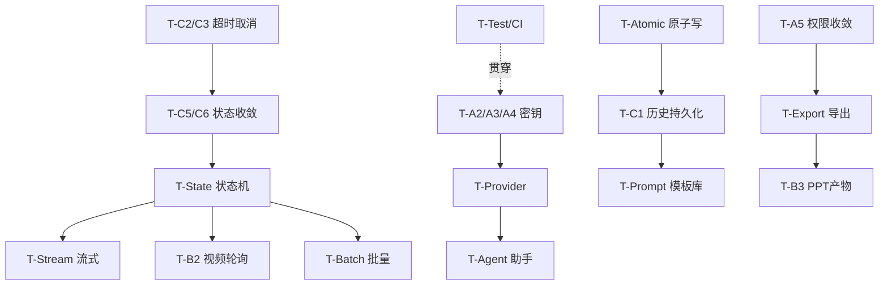

# 05 · 实施路线与任务拆解（z-biz-tool-aigen）

> 状态：设计方案，未实现；本文件**不执行任何改造**，仅为规划。
> 基线 HEAD：`713808c`
> 当前事实 = 静态代码证据；工期/资源为估算假设，非承诺。

## 阶段划分（3-5 阶段）

| 阶段 | 主题 | 目标 | 主要任务 |
| --- | --- | --- | --- |
| 阶段一 | P0 安全与正确性止血 | 密钥不泄漏、生成可控、参数生效、错误可降级 | T-A2/A3/A4、T-C2/C3、T-B1、T-C4 |
| 阶段二 | P1 可靠性与持久化 | 历史可见可持久、结果落盘、权限收敛、原子写 | T-C1/B5/B6、T-A5、T-Atomic、T-C5/C6 |
| 阶段三 | P1 生成体验 | 流式、状态机、多 Provider、提示词模板 | T-Stream、T-State、T-Provider、T-Prompt |
| 阶段四 | P2 能力补全 | 视频轮询、PPT 真实产物、导出、批量 | T-B2、T-B3、T-Export、T-Batch |
| 阶段五 | P2 治理与工程化 | Agent 重设计、审核边界、成本、测试基线、清理死代码 | T-A1、T-Agent、T-Mod、T-Cost、T-Test、T-CI |

## 阶段一（P0）

### T-A2/A3/A4 密钥安全（对应 04 §2）
- 文件级改造点：
  - [`src-tauri/src/ai_client.rs`](../../src-tauri/src/ai_client.rs) 第 49-76 行：`save_config/load_config` 改为密钥库/AEAD 存储；新增迁移逻辑（读旧明文 → 写加密 → 删旧）。
  - [`src-tauri/src/commands.rs`](../../src-tauri/src/commands.rs) 第 98-109 行：`load_api_config` 返回 `{base_url, has_key}` 而非完整 key。
  - [`src-tauri/Cargo.toml`](../../src-tauri/Cargo.toml)：新增 `keyring`（或 `chacha20poly1305`+`argon2`）。
  - [`src/stores/aiStore.ts`](../../src/stores/aiStore.ts) 第 4-7、39-40、46-58 行：移除 `apiKey` 明文态，改 `hasKey`。
  - [`src/App.tsx`](../../src/App.tsx) 第 27/32/42/117-122 行：key 输入单向保存、掩码展示。
  - [`src-tauri/tauri.conf.json`](../../src-tauri/tauri.conf.json) 第 23 行：设置 CSP。
- 前置依赖：无（可最先做）。角色：Rust + 前端。
- 兼容/回滚：保留旧明文读取分支一个版本；回滚即恢复明文读写函数（但已加密数据需迁移工具）。

### T-C2/C3 超时与取消（对应 03 §2.1/2.3）
- 文件级：
  - [`src-tauri/src/ai_client.rs`](../../src-tauri/src/ai_client.rs) 第 85/139/189 行：全局 `Client::builder().timeout(...)`；引入 `CancellationToken` 存入 `AppState`（第 33-46 行）。
  - [`src-tauri/src/commands.rs`](../../src-tauri/src/commands.rs)：新增 `cancel_generation(request_id)`；`lib.rs` 第 14-22 行注册。
  - [`src/_shared/useGeneration.ts`](../../src/_shared/useGeneration.ts) 第 12-37 行：暴露 `cancel()`。
  - 面板（[`TextGenPanel.tsx`](../../src/components/TextGenPanel.tsx) 等）：loading 时按钮改"取消"。
- 前置：无。角色：Rust + 前端。回滚：cancel 命令可独立回退，不影响生成主链路。

### T-B1 图片参数生效（对应 01 B1）
- 文件级：
  - [`src-tauri/src/commands.rs`](../../src-tauri/src/commands.rs) 第 6-10 行：`generate_image` 增加 `model: Option<String>`、`size: Option<String>`。
  - [`src-tauri/src/ai_client.rs`](../../src-tauri/src/ai_client.rs) 第 80-91 行：请求体带 `model`、动态 `size`。
- 前置：T-Provider 更彻底，但 P0 先做参数透传最小修复。角色：Rust。回滚：恢复硬编码即可。

### T-C4 错误分级降级（对应 03 §7）
- 文件级：
  - [`src-tauri/src/ai_client.rs`](../../src-tauri/src/ai_client.rs)：错误映射为结构化 `{code,message,retryable}`，脱敏（不含 key/body）。
  - [`src/_shared/useGeneration.ts`](../../src/_shared/useGeneration.ts) 第 23-24 行：按 code 展示友好文案。
  - [`src/_shared/States.tsx`](../../src/_shared/States.tsx) 第 61-76 行：`ErrorState` 支持 code 分支。
- 前置：无。角色：Rust + 前端。

## 阶段二（P1）

### T-C1/B5/B6 历史持久化（对应 03 §6）
- 文件级：
  - [`src-tauri/src/ai_client.rs`](../../src-tauri/src/ai_client.rs) 第 33-46 行：`AppState` 增加持久层句柄（SQLite/JSONL）。
  - [`src-tauri/src/commands.rs`](../../src-tauri/src/commands.rs) 第 19-34、127-134 行：写入落盘、`now_str` 改 ISO8601、图片结果改文件引用。
  - [`src-tauri/Cargo.toml`](../../src-tauri/Cargo.toml)：新增 `rusqlite`（或 `chrono`）。
- 前置：T-Atomic。角色：Rust。回滚：保留内存实现开关。

### T-Atomic 原子写（对应 04 §5）
- 文件级：[`src-tauri/src/ai_client.rs`](../../src-tauri/src/ai_client.rs) 第 57-64、319 行：封装 `atomic_write(path, bytes)`（tmp+fsync+rename）。
- 前置：无。角色：Rust。

### T-A5 权限收敛（对应 04 §7）
- 文件级：[`src-tauri/capabilities/default.json`](../../src-tauri/capabilities/default.json) 第 6-12 行：移除 `shell:default`、`fs` 改 scoped。
- 前置：导出功能改走 dialog（T-Export）后再彻底移 shell；可分两步。角色：配置。

### T-C5/C6 前端状态收敛（对应 03 §9）
- 文件级：新增 `src/stores/generationStore.ts`（规划新增）；改造 [`src/stores/aiStore.ts`](../../src/stores/aiStore.ts)、四面板与 [`src/App.tsx`](../../src/App.tsx) 第 91-94 行（结果跨面板保留）。
- 前置：T-C3（取消需要统一 requestId）。角色：前端。

## 阶段三（P1）

### T-Stream 文本流式（对应 03 §2.2）
- 文件级：[`src-tauri/src/ai_client.rs`](../../src-tauri/src/ai_client.rs) 第 134-179 行 SSE 解析 + `emit`；[`src-tauri/src/commands.rs`](../../src-tauri/src/commands.rs) 新增 `generate_text_stream`；`lib.rs` 注册；前端订阅 event。
- 前置：T-State。角色：Rust + 前端。

### T-State 生成状态机（对应 03 §5）
- 文件级：`generationStore` 落地状态机；面板订阅。前置：T-C5/C6。角色：前端。

### T-Provider 多 Provider（对应 03 §3）
- 文件级：`providers.json` 模型（规划新增）；[`ai_client.rs`](../../src-tauri/src/ai_client.rs) 路由；配置弹窗 [`App.tsx`](../../src/App.tsx) 支持多 Provider 管理。
- 前置：T-A2/A3/A4（key 存储）。角色：Rust + 前端。

### T-Prompt 提示词模板库（对应 02 §1）
- 文件级：模板持久化 + 变量插槽；[`TextGenPanel.tsx`](../../src/components/TextGenPanel.tsx) 第 17-23 行硬编码模板迁入库。前置：持久层。角色：前端 + Rust。

## 阶段四（P2）

### T-B2 视频异步轮询（对应 01 B2）
- 文件级：[`src-tauri/src/ai_client.rs`](../../src-tauri/src/ai_client.rs) 第 232-236 行：实现 task 轮询直至拿到真实 URL；[`VideoGenPanel.tsx`](../../src/components/VideoGenPanel.tsx) 第 44 行进度态。前置：T-State。角色：Rust + 前端。依赖 H4 待验证。

### T-B3 PPT 真实产物（对应 01 B3）
- 文件级：[`generate_ppt_file`](../../src-tauri/src/ai_client.rs) 第 256-322 行：输出到用户目录、目标真实 `.pptx`（如 `pptx` 生成或稳定 HTML + 明确打开方式）。前置：T-Export、fs scoped。角色：Rust。

### T-Export 统一导出（对应 02 §6）
- 文件级：dialog 保存 + fs 写入，替换 [`ImageGenPanel.tsx`](../../src/components/ImageGenPanel.tsx) 第 49-55 行的 `<a download>`（H2）。前置：T-A5 保留 dialog。角色：前端 + Rust。

### T-Batch 批量队列（对应 02 §7）
- 文件级：`generationStore` 队列 + 并发信号量（03 §8）。前置：T-State、T-Cost。角色：前端 + Rust。

## 阶段五（P2）

### T-A1 清理 SQL Agent 死代码（对应 01 A1）
- 文件级：删除 [`src/agent/`](../../src/agent)（`AgentManager.ts`/`AgentPanel.tsx`/`SQLEditor.tsx`/`QueryHistoryViewer.tsx`/`types.ts`/`index.ts`）。前置：确认无引用（已 Grep 确认仅自引用）。角色：前端。**破坏性删除，须评审确认。**

### T-Agent 生成助手（对应 02 §8 / 04 §6）
- 全新设计，仅产出建议、不自动执行破坏操作。前置：T-Provider、T-Prompt。角色：前端 + Rust。

### T-Mod 审核边界（对应 04 §4）
- 错误映射 `CONTENT_POLICY` + 输入上限。前置：T-C4。角色：Rust。

### T-Cost 成本控制（对应 04 §8）
- 参数上限 + 请求数确认 + usage 统计。前置：T-Provider、历史 usage 字段。角色：Rust + 前端。

### T-Test / T-CI（对应 06）
- 引入 vitest（前端）+ `cargo test`（Rust）+ mock LLM 夹具；CI 增加 typecheck/lint/test 门禁（改 [`build.yml`](../../.github/workflows/build.yml)）。前置：各功能任务。角色：全栈 + DevOps。

### T-D3 依赖精简（对应 01 D3）
- [`Cargo.toml`](../../src-tauri/Cargo.toml) 第 23 行移除未用 `multipart`，显式 TLS。角色：Rust。

## 依赖关系图

## 资源假设与角色

- 角色：Rust 后端、React 前端、DevOps（CI）、QA（测试）。多数任务需前后端协作。
- 估算假设：单人全栈，阶段一约 3-5 人日、阶段二 4-6、阶段三 5-8、阶段四 5-8、阶段五 4-6（**估算，非承诺**）。
- 环境假设：不新增运行时服务；密钥库依赖 OS 能力；测试用 mock LLM（06）。

## 兼容与回滚策略

- 每个任务独立分支/PR，保留 feature flag（如 `persist_history`、`stream_text`）。
- 数据迁移（明文→加密 config、内存→落盘历史）提供一次性迁移 + 回滚工具，迁移前备份。
- 破坏性任务（T-A1 删目录、清空数据）须二次确认与评审（04 §6）。
