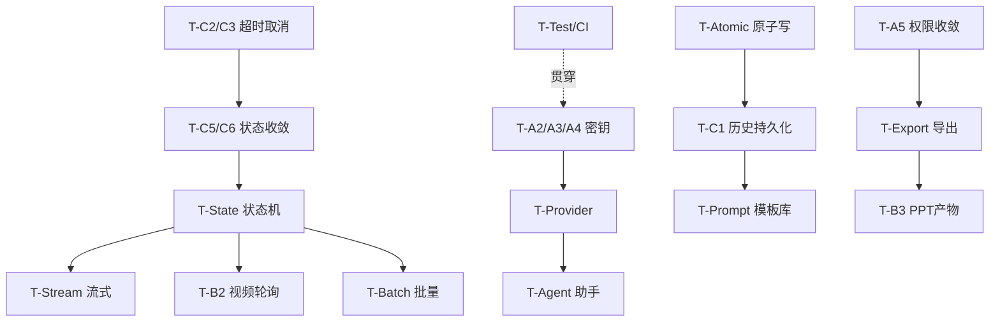

# 05 · 实施路线与任务拆解（z-biz-tool-aigen）

> 状态：设计方案，未实现；本文件**不执行任何改造**，仅为规划。
> 基线 HEAD：`713808c`
> 当前事实 = 静态代码证据；工期/资源为估算假设，非承诺。

| 阶段 | 主题 | 状态（2026-09-22 实施回填） |
| --- | --- | --- |
| 阶段一 | P0 安全与正确性止血 | ✅ 全部完成（另修掉审计外的 P0-0 配置链路断裂） |
| 阶段二 | P1 可靠性与持久化 | ✅ 全部完成（含 02 §5 历史抽屉） |
| 阶段三 | P1 生成体验 | 🟡 T-Stream / T-Provider / T-Prompt 完成；`submit_generation`/`get_generation` 统一入口未做 |
| 阶段四 | P2 能力补全 | 🟡 T-Export / T-B2 / T-Batch 完成；T-B3 停在"稳定 HTML + 可导出"，真 `.pptx` 未做 |
| 阶段五 | P2 治理与工程化 | 🟡 T-CI / T-Test / T-Cost / T-Mod / T-Agent 完成；只剩 T-A1（删 `src/agent/`）待用户评审 |

## 阶段划分（3-5 阶段）

| 阶段 | 主题 | 目标 | 主要任务 |
| --- | --- | --- | --- |
| 阶段一 | P0 安全与正确性止血 | 密钥不泄漏、生成可控、参数生效、错误可降级 | T-A2/A3/A4、T-C2/C3、T-B1、T-C4 |
| 阶段二 | P1 可靠性与持久化 | 历史可见可持久、结果落盘、权限收敛、原子写 | T-C1/B5/B6、T-A5、T-Atomic、T-C5/C6 |
| 阶段三 | P1 生成体验 | 流式、状态机、多 Provider、提示词模板 | T-Stream、T-State、T-Provider、T-Prompt |
| 阶段四 | P2 能力补全 | 视频轮询、PPT 真实产物、导出、批量 | T-B2、T-B3、T-Export、T-Batch |
| 阶段五 | P2 治理与工程化 | Agent 重设计、审核边界、成本、测试基线、清理死代码 | T-A1、T-Agent、T-Mod、T-Cost、T-Test、T-CI |

## 阶段一（P0）

### T-A2/A3/A4 密钥安全（对应 04 §2）
- 文件级改造点：
  - [`src-tauri/src/ai_client.rs`](../../src-tauri/src/ai_client.rs) 第 49-76 行：`save_config/load_config` 改为密钥库/AEAD 存储；新增迁移逻辑（读旧明文 → 写加密 → 删旧）。
  - [`src-tauri/src/commands.rs`](../../src-tauri/src/commands.rs) 第 98-109 行：`load_api_config` 返回 `{base_url, has_key}` 而非完整 key。
  - [`src-tauri/Cargo.toml`](../../src-tauri/Cargo.toml)：新增 `keyring`（或 `chacha20poly1305`+`argon2`）。
  - [`src/stores/aiStore.ts`](../../src/stores/aiStore.ts) 第 4-7、39-40、46-58 行：移除 `apiKey` 明文态，改 `hasKey`。
  - [`src/App.tsx`](../../src/App.tsx) 第 27/32/42/117-122 行：key 输入单向保存、掩码展示。
  - [`src-tauri/tauri.conf.json`](../../src-tauri/tauri.conf.json) 第 23 行：设置 CSP。
- 前置依赖：无（可最先做）。角色：Rust + 前端。
- 兼容/回滚：保留旧明文读取分支一个版本；回滚即恢复明文读写函数（但已加密数据需迁移工具）。

### T-C2/C3 超时与取消（对应 03 §2.1/2.3）
- 文件级：
  - [`src-tauri/src/ai_client.rs`](../../src-tauri/src/ai_client.rs) 第 85/139/189 行：全局 `Client::builder().timeout(...)`；引入 `CancellationToken` 存入 `AppState`（第 33-46 行）。
  - [`src-tauri/src/commands.rs`](../../src-tauri/src/commands.rs)：新增 `cancel_generation(request_id)`；`lib.rs` 第 14-22 行注册。
  - [`src/_shared/useGeneration.ts`](../../src/_shared/useGeneration.ts) 第 12-37 行：暴露 `cancel()`。
  - 面板（[`TextGenPanel.tsx`](../../src/components/TextGenPanel.tsx) 等）：loading 时按钮改"取消"。
- 前置：无。角色：Rust + 前端。回滚：cancel 命令可独立回退，不影响生成主链路。

### T-B1 图片参数生效（对应 01 B1）
- 文件级：
  - [`src-tauri/src/commands.rs`](../../src-tauri/src/commands.rs) 第 6-10 行：`generate_image` 增加 `model: Option<String>`、`size: Option<String>`。
  - [`src-tauri/src/ai_client.rs`](../../src-tauri/src/ai_client.rs) 第 80-91 行：请求体带 `model`、动态 `size`。
- 前置：T-Provider 更彻底，但 P0 先做参数透传最小修复。角色：Rust。回滚：恢复硬编码即可。

### T-C4 错误分级降级（对应 03 §7）
- 文件级：
  - [`src-tauri/src/ai_client.rs`](../../src-tauri/src/ai_client.rs)：错误映射为结构化 `{code,message,retryable}`，脱敏（不含 key/body）。
  - [`src/_shared/useGeneration.ts`](../../src/_shared/useGeneration.ts) 第 23-24 行：按 code 展示友好文案。
  - [`src/_shared/States.tsx`](../../src/_shared/States.tsx) 第 61-76 行：`ErrorState` 支持 code 分支。
- 前置：无。角色：Rust + 前端。

## 阶段二（P1）

### T-C1/B5/B6 历史持久化（对应 03 §6）
- 文件级：
  - [`src-tauri/src/ai_client.rs`](../../src-tauri/src/ai_client.rs) 第 33-46 行：`AppState` 增加持久层句柄（SQLite/JSONL）。
  - [`src-tauri/src/commands.rs`](../../src-tauri/src/commands.rs) 第 19-34、127-134 行：写入落盘、`now_str` 改 ISO8601、图片结果改文件引用。
  - [`src-tauri/Cargo.toml`](../../src-tauri/Cargo.toml)：新增 `rusqlite`（或 `chrono`）。
- 前置：T-Atomic。角色：Rust。回滚：保留内存实现开关。

### T-Atomic 原子写（对应 04 §5）
- 文件级：[`src-tauri/src/ai_client.rs`](../../src-tauri/src/ai_client.rs) 第 57-64、319 行：封装 `atomic_write(path, bytes)`（tmp+fsync+rename）。
- 前置：无。角色：Rust。

### T-A5 权限收敛（对应 04 §7）
- 文件级：[`src-tauri/capabilities/default.json`](../../src-tauri/capabilities/default.json) 第 6-12 行：移除 `shell:default`、`fs` 改 scoped。
- 前置：导出功能改走 dialog（T-Export）后再彻底移 shell；可分两步。角色：配置。

### T-C5/C6 前端状态收敛（对应 03 §9）
- 文件级：新增 `src/stores/generationStore.ts`（规划新增）；改造 [`src/stores/aiStore.ts`](../../src/stores/aiStore.ts)、四面板与 [`src/App.tsx`](../../src/App.tsx) 第 91-94 行（结果跨面板保留）。
- 前置：T-C3（取消需要统一 requestId）。角色：前端。

## 阶段三（P1）

### T-Stream 文本流式（对应 03 §2.2）
- 文件级：[`src-tauri/src/ai_client.rs`](../../src-tauri/src/ai_client.rs) 第 134-179 行 SSE 解析 + `emit`；[`src-tauri/src/commands.rs`](../../src-tauri/src/commands.rs) 新增 `generate_text_stream`；`lib.rs` 注册；前端订阅 event。
- 前置：T-State。角色：Rust + 前端。

### T-State 生成状态机（对应 03 §5）
- 文件级：`generationStore` 落地状态机；面板订阅。前置：T-C5/C6。角色：前端。

### T-Provider 多 Provider（对应 03 §3）
- 文件级：`providers.json` 模型（规划新增）；[`ai_client.rs`](../../src-tauri/src/ai_client.rs) 路由；配置弹窗 [`App.tsx`](../../src/App.tsx) 支持多 Provider 管理。
- 前置：T-A2/A3/A4（key 存储）。角色：Rust + 前端。

### T-Prompt 提示词模板库（对应 02 §1）
- 文件级：模板持久化 + 变量插槽；[`TextGenPanel.tsx`](../../src/components/TextGenPanel.tsx) 第 17-23 行硬编码模板迁入库。前置：持久层。角色：前端 + Rust。

## 阶段四（P2）

### T-B2 视频异步轮询（对应 01 B2）
- 文件级：[`src-tauri/src/ai_client.rs`](../../src-tauri/src/ai_client.rs) 第 232-236 行：实现 task 轮询直至拿到真实 URL；[`VideoGenPanel.tsx`](../../src/components/VideoGenPanel.tsx) 第 44 行进度态。前置：T-State。角色：Rust + 前端。依赖 H4 待验证。

### T-B3 PPT 真实产物（对应 01 B3）
- 文件级：[`generate_ppt_file`](../../src-tauri/src/ai_client.rs) 第 256-322 行：输出到用户目录、目标真实 `.pptx`（如 `pptx` 生成或稳定 HTML + 明确打开方式）。前置：T-Export、fs scoped。角色：Rust。

### T-Export 统一导出（对应 02 §6）
- 文件级：dialog 保存 + fs 写入，替换 [`ImageGenPanel.tsx`](../../src/components/ImageGenPanel.tsx) 第 49-55 行的 `<a download>`（H2）。前置：T-A5 保留 dialog。角色：前端 + Rust。

### T-Batch 批量队列（对应 02 §7）
- 文件级：`generationStore` 队列 + 并发信号量（03 §8）。前置：T-State、T-Cost。角色：前端 + Rust。

## 阶段五（P2）

### T-A1 清理 SQL Agent 死代码（对应 01 A1）
- 文件级：删除 [`src/agent/`](../../src/agent)（`AgentManager.ts`/`AgentPanel.tsx`/`SQLEditor.tsx`/`QueryHistoryViewer.tsx`/`types.ts`/`index.ts`）。前置：确认无引用（已 Grep 确认仅自引用）。角色：前端。**破坏性删除，须评审确认。**

### T-Agent 生成助手（对应 02 §8 / 04 §6）
- 全新设计，仅产出建议、不自动执行破坏操作。前置：T-Provider、T-Prompt。角色：前端 + Rust。

### T-Mod 审核边界（对应 04 §4）
- 错误映射 `CONTENT_POLICY` + 输入上限。前置：T-C4。角色：Rust。

### T-Cost 成本控制（对应 04 §8）
- 参数上限 + 请求数确认 + usage 统计。前置：T-Provider、历史 usage 字段。角色：Rust + 前端。

### T-Test / T-CI（对应 06）
- 引入 vitest（前端）+ `cargo test`（Rust）+ mock LLM 夹具；CI 增加 typecheck/lint/test 门禁（改 [`build.yml`](../../.github/workflows/build.yml)）。前置：各功能任务。角色：全栈 + DevOps。

### T-D3 依赖精简（对应 01 D3）
- [`Cargo.toml`](../../src-tauri/Cargo.toml) 第 23 行移除未用 `multipart`，显式 TLS。角色：Rust。

## 依赖关系图

## 资源假设与角色

- 角色：Rust 后端、React 前端、DevOps（CI）、QA（测试）。多数任务需前后端协作。
- 估算假设：单人全栈，阶段一约 3-5 人日、阶段二 4-6、阶段三 5-8、阶段四 5-8、阶段五 4-6（**估算，非承诺**）。
- 环境假设：不新增运行时服务；密钥库依赖 OS 能力；测试用 mock LLM（06）。

## 兼容与回滚策略

- 每个任务独立分支/PR，保留 feature flag（如 `persist_history`、`stream_text`）。
- 数据迁移（明文→加密 config、内存→落盘历史）提供一次性迁移 + 回滚工具，迁移前备份。
- 破坏性任务（T-A1 删目录、清空数据）须二次确认与评审（04 §6）。

---

## 落地进度回填（2026-09-22，阶段一）

> 本节为实施回填，非原设计方案。基线 HEAD `16c0969`。

### 审计外发现的阻断缺陷：P0-0「配置从未送达 Rust」

原文档 01/04 认定「`load_api_config` 把明文 key 全量回传前端」。实施时该前提已不成立：
[`aiStore.ts`](../../src/stores/aiStore.ts) 在 `7ba1d05` 之后改走 `z-biz-tool-shared` 的
`useAIManager` + `localStorage`，而四个面板仍经
[`useGeneration`](../../src/_shared/useGeneration.ts) `invoke()` 打到 Rust。
`load_api_config` / `save_api_config` / `get_history` 在前端**零调用**（全仓 Grep 证实）。

后果：Rust `AppState.config` 永远是 `api_key=""` + 默认 minimax 端点，
**四类生成 100% 不可能成功**；同时 key 以明文进了 localStorage 与渲染进程内存
（`AIManager` 的 `OpenAIClient.chat` 用浏览器 `fetch` 直发 `Authorization`，正是 00 §独特价值 2 所说"未兑现"的那条路）。

修复：配置唯一入口改回 Tauri command；`lib.rs` `setup()` 启动即从加密存储载入；
删除 store 中未使用的 `generateImage/Text/Video/Ppt` 死路径与 `z-biz-tool-shared` 依赖；
`load_api_config` 只回 `{base_url, has_key, key_masked}`。

### 阶段一任务状态

| 任务 | 状态 | 落点 |
| --- | --- | --- |
| P0-0 配置链路 | 已完成 | `lib.rs` setup、`aiStore.ts`、`App.tsx` |
| T-A2/A3/A4 密钥 | 已完成 | 新增 `secret.rs`（XChaCha20Poly1305 + 明文迁移 + 0600 主密钥）；`load_api_config` 去明文；CSP 落地 |
| T-C2/C3 超时/取消 | 已完成 | 共享 `Client` + 分级超时；`AppState.tasks` 注册 `CancellationToken`；新增 `cancel_generation`；`useGeneration.cancel()`；四面板"取消生成"按钮 |
| T-B1 图片参数 | 已完成 | `generate_image` 收 `model`/`size`，`normalize_size` 白名单后下发 |
| T-C4 错误分级 | 已完成 | 新增 `error.rs`（03 §7 全码 + `INVALID_PARAM`），`useGeneration`/`ErrorState` 按 code 降级 |
| T-A5 权限收敛 | 提前完成 | capabilities 去 `shell`/`fs`（前端 Grep 证实零调用），Rust 卸载两插件 |
| T-Atomic 原子写 | 提前完成 | `secret::atomic_write`（tmp+fsync+rename），config / PPT / 主密钥统一走它 |
| T-D3 依赖精简 | 提前完成 | 去 `multipart`，`reqwest` 显式 `rustls-tls` |

#### 阶段二任务状态（同日完成）

| 任务 | 状态 | 落点 |
| --- | --- | --- |
| T-C1 历史落盘 | 已完成 | 新增 [`history.rs`](../../src-tauri/src/history.rs)：JSONL 追加 + 超量压实、坏行跳过并留 `history.jsonl.bak`、上限 500 条 |
| B5 ISO8601 | 已完成 | `history::now_iso8601()`（chrono），替换裸秒 `now_str` |
| B6 结果文件引用 | 已完成 | 图片 base64 与远端 URL 统一落盘 `results/{id}-{n}.{ext}`，历史只存相对路径；PPT 产物从 temp 迁到 `results/` |
| T-C5/C6 状态收敛 | 已完成 | 新增 [`generationStore.ts`](../../src/stores/generationStore.ts)；**删除** `src/_shared/useGeneration.ts`；四面板与提示词全部改由 store 持有 |
| 历史 UI（02 §5） | 已完成 | 新增 [`HistoryDrawer.tsx`](../../src/components/HistoryDrawer.tsx)：类型筛选 / 关键词搜索 / 分页 / 收藏 / 删除 / 清空 / 提示词回填迭代 |
| IPC 契约（03 §11.1） | 部分完成 | 新增 `list_history`（取代 `get_history`）、`delete_history`、`clear_history`、`set_history_favorite`、`data_dir_path`；`submit_generation`/`get_generation` 统一入口仍属阶段三 T-State |

配套：`tauri.conf.json` 打开 `assetProtocol`（scope 限定 `$HOME/.z-biz-tool-aigen/results/**`）、`tauri` 加 `protocol-asset` feature、CSP 的 `img-src`/`media-src` 增补 `asset: http://asset.localhost`，历史缩略图据此读本地文件。

阶段三及以后剩余：T-Stream、T-State、T-Provider、T-Prompt；T-B2、T-B3、T-Export、T-Batch；T-A1、T-Agent、T-Mod、T-Cost、T-Test/T-CI。

#### 阶段三任务状态（进行中）

| 任务 | 状态 | 落点 |
| --- | --- | --- |
| T-Stream 文本流式 | 已完成 | 新增 [`stream.rs`](../../src-tauri/src/stream.rs)（字节缓冲 SSE 解析器 + `StreamEvent`）；`generate_text_stream_api` 走 `bytes_stream` 逐块解析并 `emit("aigen://stream/{request_id}")`；`reqwest` 开 `stream` feature |
| T-State 状态机 | 部分完成 | `generationStore` 状态扩为 `idle/submitting/streaming/succeeded/failed/cancelled` 并新增 `partial` 累积；**未做**：03 §11.1 的 `submit_generation`/`get_generation` 统一入口（现仍按 kind 分命令） |
| T-Provider 多 Provider | 已完成 | `AppConfig{providers[],active{kind→id}}` 取代单 `base_url`；`AppConfig::resolve` 按能力路由 + 模型白校验（**修 B4**）；旧配置自动迁移为单个全能力 `default` 服务商；新命令 `delete_provider`/`set_active_provider`/`test_provider`（连通性校验，补 02 §9）；UI 为 `ProviderSettings.tsx`（增删改 + 掩码 + 测试连通 + 导入模型白名单 + 各类默认服务商）；面板模型下拉改由服务商驱动 |
| T-Prompt 模板库 | 未开始 | `TextGenPanel` 仍硬编码 `promptTemplates` |

| T-Prompt 模板库 | 已完成 | 新增 [`templates.rs`](../../src-tauri/src/templates.rs)（`templates.json` 原子写 + `{变量}` 抽取/渲染 + 缺失变量回报）、命令 `list_templates`/`save_template`/`delete_template`/`set_template_favorite`/`render_template`、UI [`TemplateManager.tsx`](../../src/components/TemplateManager.tsx)（搜索/新建/编辑/收藏/删除）；`TextGenPanel` 硬编码的 5 个模板迁为 **builtin** 种子（首启自动落盘），变量分插槽、`{正文/内容/主体/产品}` 自动绑大输入框 |
| 03 §4 参数化 | 已完成 | `TextOptions{system,temperature,maxTokens}` 取代写死的 `temperature: 0.7`；越界收敛（温度 0–2、`max_tokens ≤ 8000`、系统提示 ≤4000 字），文本面板新增温度/最大字数/系统提示控件 |
| 未完成（阶段三收尾项） | 待做 | 03 §11.1 的 `submit_generation`/`get_generation` 统一入口；02 §1.2 图片"负面提示词/参考图"字段（风格预设已可作为 image 模板使用） |

设计取舍：流式命令**仍返回全文**（而非 03 §11.1 的"立即返回 request_id"）。
跨面板保活由 `generationStore` 承担（动作持有 promise，组件卸载不影响），
因此保留 `invoke` 的 resolve/reject 语义，取消与错误契约可直接沿用非流式那条路，不必两套。
上游若无视 `stream:true` 直接回整段 JSON，降级为一次性交付而不报错（03 §7 PARSE 的降级取向）。

#### 阶段四任务状态（进行中）

| 任务 | 状态 | 落点 |
| --- | --- | --- |
| T-Export 统一导出 | 已完成 | 新增 [`export.rs`](../../src-tauri/src/export.rs)：源可为**已落盘结果文件 / 历史记录 / data URL / 远程 URL / 纯文本**，原子写目标；已存在则返回 `CONFLICT`，必须带 `allow_overwrite` 才覆盖（04 §6）。前端 [`export.ts`](../../src/_shared/export.ts) 走 `dialog` 的 `save()` 选路径 + `Modal.confirm` 二次确认；接入图片卡片、文本结果、视频结果、历史抽屉每条记录（**取代 `<a download>`，H2 关闭**） |
| T-B2 视频轮询 | 已完成 | `poll_video_task` + `parse_task_response`：3 个候选任务端点依次试（404 自动降级下一个），`aigen://progress/{request_id}` 推 `{percent, stage}`，预算 5 分钟、可取消；面板自动续轮询并显示进度条 |
| T-B3 PPT 真实产物 | 部分完成 | 产物已从 temp 迁到 `results/*.html`（不再被系统清理）并可经历史导出；**真 `.pptx` 未做**（需 zip+OOXML 依赖），当前定位"稳定 HTML + 明确打开方式" |
| T-Batch 批量队列 | 已完成 | `AppState.gate`（`tokio Semaphore`，容量 `MAX_CONCURRENT_GENERATIONS=2`）在 5 个生成命令里取额度，排队等待**可取消**；前端 `batchStore.ts` + `BatchPanel.tsx`：多行提示词逐条下发、整体进度、单条取消/重试、成功行可导出，启动前 `Modal.confirm` 明示「将发起 N 次请求」（04 §8.2） |

#### 阶段三补充（同日）

`generationStore` 新增 `polling` 状态与 `progress` 字段、`pollVideo` 专用动作（见偏差 12）。

#### 阶段五任务状态（进行中）

| 任务 | 状态 | 落点 |
| --- | --- | --- |
| T-CI 质量门禁 | 已完成 | 新增 [`.github/workflows/quality.yml`](../../.github/workflows/quality.yml)：前端 `typecheck + vitest + build`，Rust `fmt --check + clippy -D warnings + cargo test --locked` 跑 **ubuntu/macos/windows 三端**（`cfg(unix)`/`cfg(windows)` 分支只有 CI 编得到）。未改 `build.yml`、未推送 |
| T-Test 测试基线 | 已完成 | Rust 102 个单测（wiremock 假上游 + 假 key）；前端首个测试基线 41 个：`genError.test.ts`（脱敏/截断/requestId 退化路径）、`aiStore.test.ts`（能力路由与"空密钥→null 不修改"）、`generationStore.test.ts`（取消竞态、流式累加、事件通道失败降级、轮询保留句柄）、`batchStore.test.ts`（逐条 requestId、单条重试、cancelAll） |
| T-Cost 成本控制 | 已完成 | 参数上限（图片 `count ≤ 10`、`max_tokens ≤ 8000`、温度收敛到 0–2、系统提示与模板正文各 ≤4000 字）+ 批量前「将发起 N 次请求」确认 + `usage` 入库（文本/流式都回传）与历史抽屉逐条·累计展示 |
| T-Mod 审核边界 | 已完成 | 上游 `content_policy` 类响应映射为 `CONTENT_POLICY` 且**不重试不绕过**（03 §7 表 + 单测）；只做输入上限，不加本地关键词黑名单 |
| T-A1 清理 SQL Agent 死代码 | ⬜ 待评审 | `src/agent/` 6 文件仍是零引用 mock，**破坏性删除需用户确认** |
| T-Agent 生成助手 | 已完成 | 新增 [`assistant.rs`](../../src-tauri/src/assistant.rs)：诊断码→可执行建议（`CONTENT_POLICY` 明确"不提供绕过手段"）、本地启发式（长度/否定式/缺风格/超长输入）、最多 1 次上游调用（`max_tokens ≤ 500`）、模型返回非 JSON 时**降级为纯本地建议**而非报错、取消透传。前端 `assistantStore.ts` + `AssistantDrawer.tsx`：两个动作（填入草稿 / 存为我的模板）**都必须用户点击** |
| T-A1 清理 SQL Agent 死代码 | ⬜ 待评审 | `src/agent/` 6 文件仍是零引用 mock，**破坏性删除需用户确认** |

### 与设计方案的偏差

1. **密钥存储选 AEAD 而非 `keyring`**：04 §2.1 两者皆可。`keyring` 在无 GUI 的 Linux/CI 上不可用
   （06 R2 的降级情形），AEAD 路径全平台一致。**代价**：主密钥文件与密文同目录，
   防的是配置文件被备份/扫描/误传，不防已控制该用户账号的进程——后者由"key 不再进渲染进程"兜住。
2. **`UPSTREAM_5XX` 不自动重试**：03 §2.4 要求 5xx/429/超时都重试，04 §8.4 要求"失败不重复扣费"。
   两者冲突，取更保守的一条：只自动重试 `RATE_LIMIT`/`TIMEOUT`/`NETWORK`，5xx 标 `retryable=true` 交用户决定。
3. **新增 `INVALID_PARAM` 错误码**：03 §7 矩阵没有本地校验位，而 04 §4.3 要求输入上限。
   用于 base_url 非 https、prompt 超长/为空、count 越界、size 非法等本地短路，不进入重试。
4. **取消语义**：取消后按 03 §7「静默回 Idle」，前端不把 `CANCELLED` 渲染为错误。
5. **PPT 产物按钮**：原 `<Button href="/var/...">` 在 webview 内本就打不开本地绝对路径，
   改为展示路径 + 复制。统一导出仍是阶段四 T-Export。
6. **历史选 JSONL 而非 SQLite**：03 §6 两者皆可。SQLite 需要 `rusqlite`（C 依赖 + 4 平台交叉编译风险），
   而本项目的历史规模上限 500 条、检索是子串匹配，JSONL 追加 + 压实足够。
   **代价**：无索引、无事务；筛选走内存扫描。`dropped_lines` 字段暴露受损行数。
7. **图片远端结果会额外发一次 GET 落盘**：为兑现 03 §6"结果保存为本地文件"。
   该请求**不带 Authorization**（CDN 与 API 端点通常不同域，带 key 会造成密钥外流）；
   留存失败只降级为"历史存远端 URL"，不让已成功的生成变成失败。
8. **历史抽屉的 asset URL 转换已加保护**：实测 `convertFileSrc` 抛错会把整个 React 树带崩
   （`#root` 清空），现 `toAssetUrl()` 捕获后退回路径展示。应用仍缺全局 error boundary（遗留项）。
9. **配置磁盘格式升到 v3**（`{version,providers[],active{}}`）：`load_api_config` 的返回从
   `{base_url,has_key,key_masked}` 变为 `{providers[],active:{}}`，`save_api_config` 入参增加
   `providerId/name/capabilities/models`。旧的单服务商密文配置在首次读取时自动包装为一个全能力
   `default` 服务商，用户无需重填密钥。
10. **服务商 id 唯一化**：新建时若名称 slug 与既有 id 撞车，追加 `-2/-3` 后缀
    （`unique_provider_id`）。这是浏览器实测里看到"同名服务商静默覆盖第一条"后补的守卫。
11. **导出源允许内联内容**：面板当场展示的结果没有 record id（id 由后端在写历史时生成），
    所以 `save_export` 除 `recordId` 外还接受 data URL / 远程 URL / 纯文本三种内联源；
    远程源复用 `fetch_bytes`（**不带 Authorization**，理由同偏差 7）。
12. **轮询不复用 `submit()`**：`submit` 会重置任务态，导致等待期间任务号与进度从界面上消失
    （实测就是这样暴露的），因此新增 `pollVideo` 动作：保留 `result` 里的 `task:` 句柄，只改 `status/progress`。
13. **视频任务端点仍是 H4 假设**：未对任何真实服务商核对。缓解措施是 3 个候选路径依次试
    （404 自动降级）+ 多形状响应解析 + 预算内可取消；接入真实 provider 时按 06 §3 契约测试用真实样本再校。
